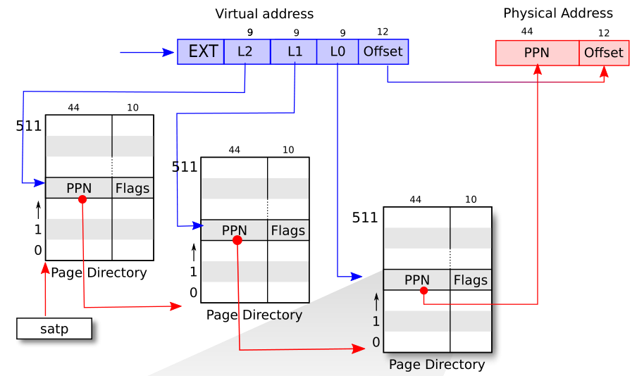
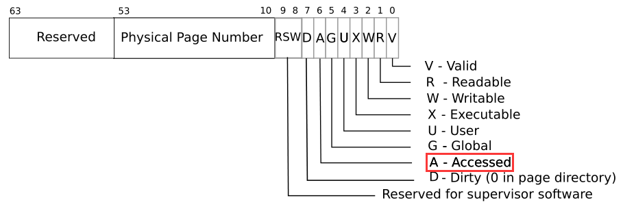

## Lab: page tables

> In this lab you will explore page tables and modify them to speed up certain system calls and to detect which pages have been accessed

本 lab 为页表（page table），涉及到 xv6 的虚拟内存、物理内存、三级页表、内存访问权限等内容，非常值得一做，能对页表机制加深理解。但是，该 lab 是利用页表，而不是编写页表，所以比较简单。一共分为 3 个子实现：

- **Speed up system calls**：要在内核和用户态之间创建一个共享的只读页，是用户态能够直接读取内核态写入的数据，从而加速系统调用。这里的页指页表中用户态和内核态均可读的一个 PTE，其指向一块物理内存。
- **Print a page table**：要在 exec 中插桩一个打印函数，使得 xv6 启动时会打印首个进程的页表信息。我们要实现这个打印函数，将三级页表的所有可用 PTE 均打印出来。
- **Detect which pages have been accessed**：利用 PTE_A 位，监控有哪些 PTE 被访问（read/write）过，将结果返回给用户态。虽然标的是 hard，但其实很简单。

需要注意，本 lab 一定要看 [xv6 book](https://pdos.csail.mit.edu/6.828/2022/xv6/book-riscv-rev3.pdf) 的 chapter 3。实验用到所有理论知识，包括一些宏介绍和函数介绍均在书中有提及。如果不看书直接做的话，会很难下手，因为不知道 xv6 三级页表的结构与映射方式。相反，看了书后，这些实验都非常简单。建议先去看书，在来看这篇文章。

从书提取出四个最关键信息：

1. xv6 运行在 Sv39 RISC-V 中，在该架构中只有 39 位的虚拟地址可用，因此实验的虚拟地址均是 39 位。

> Xv6 runs on Sv39 RISC-V , which means that only the bottom 39 bits of a 64-bit virtual address are used; the top 25 bits are not used.

2. xv6 的页表实际为一个 2^27 个页表项（PTE）的数组，只不过分三级来排布，每一级有 512 个 PTE（2^27 = 2^9 * 2^9 * 2^9）。

> A RISC-V page table is logically an array of 227 (134,217,728) page table entries (PTEs).

3. 每一个 PTE 包含 44 位的物理页号（PPN）和 10 位的 flags，剩余 10 位预留不用。第一、二级的 PPN 指向下一级页表的 PTE，而第三级的 PPN 直接指向物理内存。

> Each PTE contains a 44-bit physical page number (PPN) and some flags.

4. 映射时，xv6 先通过 39 位虚拟地址的高 27 位来寻找第三级 PTE（通过三级页表映射），然后将其中的  44 位 PPN 和虚拟地址剩下的 12 位组合成 56 位的物理地址。

> The paging hardware translates a virtual address by using the top 27 bits of the 39 bits to index into the page table to find a PTE, and making a 56-bit physical address whose top 44 bits come from the PPN in the PTE and whose bottom 12 bits are copied from the original virtual address.

综合上述四点，xv6 的映射规则如书中图 3.2 所示，如下：



了解完映射规则，还需要知道工程中和页表相关的重要结构体和重要函数。这些在书中 chapter 3.3 都有介绍，这里就不再赘述了。

开始实验。

### Speed up system calls (easy)

> Some operating systems (e.g., Linux) speed up certain system calls by sharing data in a read-only region between userspace and the kernel. This eliminates the need for kernel crossings when performing these system calls. To help you learn how to insert mappings into a page table, your first task is to implement this optimization for the `getpid()` system call in xv6.

本实验要通过页表来加速系统调用，以 getpid 为例。个人觉得这个名字起的不是很好，不应该是加速系统调用，而是跳过系统调用加速读取内核。我们知道，用户态是不能直接读取内核态的数据，而是要通过系统调用。如果创建一个可读 PTE 指向一块内存，该 PTE 是用户态和内核态共享的，那么用户态就可以直接读取这块内核数据，而无需经过复杂的系统调用。

porc 结构是内核态数据，用户态无法直接读取，因此需要通过系统调用 getpid 来读到 pid。这里需要我们创建一个共享 PTE，将虚拟地址 USYSCALL 映射到 pid 的物理地址，这样用户态直接读取 USYSCALL 就可以获取到 pid 了。 ugetpid 位于 `user/ulib.c`， 意味用户态的 getpid，代码如下：

```c
int
ugetpid(void)
{
  struct usyscall *u = (struct usyscall *)USYSCALL;
  return u->pid;
}
```

主要的代码实现位于 `kernel/proc.c` 中。首先，我们 proc 新增一个字段，存放 usyscall 的地址：

 ```c
// kernel/proc.h
struct proc {
  // ...  
  struct usyscall *usyscall;
}
 ```

在 allocproc 时，为其分配一块物理内存，分配方式可参考 trapframe 的分配。

```c
// kernel/proc.c
static struct proc*
allocproc(void)
{
  // ...
  // Allocate a trapframe page.
  if((p->trapframe = (struct trapframe *)kalloc()) == 0){
    freeproc(p);
    release(&p->lock);
    return 0;
  }

  // lab3.1 alloc usyscall
  if((p->usyscall = (struct usyscall *)kalloc()) == 0){
    freeproc(p);
    release(&p->lock);
    return 0;
  }
  // ...
}
```

proc 有一个字段名为 pagetable，它就是一个 uint64，存放页表的地址。页表的初始化位于函数 proc_pagetable 中，通过 mappages 在页表中注册新的 PTE，参考 TRAPFRAME 的方式，将 USYSCALL 映射到 p->usyscall 中。注意映射之前要先赋值 p->usyscall->pid = p->pid。

```c
// kernel/proc.c
pagetable_t
proc_pagetable(struct proc *p)
{
  pagetable_t pagetable;
  // ...
  // map the trapframe page just below the trampoline page, for
  // trampoline.S.
  if(mappages(pagetable, TRAPFRAME, PGSIZE,
              (uint64)(p->trapframe), PTE_R | PTE_W) < 0){
    uvmunmap(pagetable, TRAMPOLINE, 1, 0);
    uvmfree(pagetable, 0);
    return 0;
  }

  // lab3, map one read-only page at USYSCALL, store the PID
  p->usyscall->pid = p->pid;
  if(mappages(pagetable, USYSCALL, PGSIZE,(uint64)p->usyscall, PTE_R | PTE_U) < 0){
    uvmunmap(pagetable, USYSCALL, 1, 0);
    uvmfree(pagetable, 0);
  }

  return pagetable;
}
```

需要注意的一点是，flag 位不仅仅要置位 PTE_R，还要置位 PTE_U。只有置位了 PTE_U 的页，用户态才有权访问，否则只能 supervisor mode 才能访问。RISC-V 一共有三个特权级，如下：

| Level | Encodeing | 特权级           | 缩写 | 权限                       |
| ----- | --------- | ---------------- | ---- | -------------------------- |
| 0     | 00        | User/Application | U    | 运行用户程序               |
| 1     | 01        | Supervisor       | S    | 运行操作系统内核和驱动     |
| 2     | 10        | -                | -    |                            |
| 3     | 11        | Machine          | M    | 运行 BootLoader 和其他固件 |

新增完映射后，我们需要在进程 free 时对其解映射，位于函数 proc_freepagetable 中，可以参考 TRAPFRAME 的解映射。

```c
// kernel/proc.c
void
proc_freepagetable(pagetable_t pagetable, uint64 sz)
{
  uvmunmap(pagetable, TRAMPOLINE, 1, 0);
  uvmunmap(pagetable, TRAPFRAME, 1, 0);
  uvmunmap(pagetable, USYSCALL, 1, 0);
  uvmfree(pagetable, sz);
}
```

至此，页表相关的操作就完成了。但是在 freepagetable 只解映射了页表，并没有释放给 usyscall 分配的物理内存，因此需要在 freeproc 处将其释放，可以参考 trapframe 的释放方式。

```c
// kernel/proc.c
static void
freeproc(struct proc *p)
{
  if(p->trapframe)
    kfree((void*)p->trapframe);
  p->trapframe = 0;
  // ...
  if(p->usyscall)
    kfree((void*)p->usyscall);
  p->usyscall = 0;
}
```

需要提一嘴，为什么要给 proc 新的字段 usyscall，直接在 proc_pagetable 处定义一个变量，kalloc 一片内存给他，赋值为 pid 然后 mappages 不行吗？当然也可以，只不过分配的这篇物理内存就不好释放，所以建议在 proc 中定义新字段。

### Print a page table (easy)

> To help you visualize RISC-V page tables, and perhaps to aid future debugging, your second task is to write a function that prints the contents of a page table.
>
> Define a function called `vmprint()`. It should take a `pagetable_t` argument, and print that pagetable in the format described below. Insert `if(p->pid==1) vmprint(p->pagetable)` in exec.c just before the `return argc`, to print the first process's page table. You receive full credit for this part of the lab if you pass the `pte printout` test of `make grade`.

本实验首先要实现一个内核函数 vmprint，其接收一个 pagetable，能够将其中所有的可用 PTE 的信息全部打印出来。函数实现很简单，可用参考 freewalk 函数，且三级页表甚至不需要用到递归，循环遍历一下就行。

函数实现需要用到 `kernel/riscv.h` 中定义的宏，都是和地址有关的移位操作。

```c
// kernel/riscv.h
// 物理内存转PTE
#define PA2PTE(pa) ((((uint64)pa) >> 12) << 10)
// PTE转物理内存
#define PTE2PA(pte) (((pte) >> 10) << 12)
// 取到PTE的flags
#define PTE_FLAGS(pte) ((pte) & 0x3FF)
```

和虚拟地址有关的内核函数位于 `kernel/vm.c` 中，因此 vmprint 也放在里面，代码如下，注意一下类型转换。

```c
// kernel/vm.c
void 
vmprint(pagetable_t pagetable)
{
  printf("page table %p\n", pagetable);
  for(int i = 0; i < 512; i++){
    pte_t pte = pagetable[i];
    if(pte & PTE_V){
      printf("..%d: pte %p pa %p\n", i, pte, PTE2PA(pte));
      pagetable_t second = (pagetable_t)PTE2PA(pte);
      for(int j = 0; j < 512; j++){
        pte = second[j];
        if(pte & PTE_V){
          printf(".. ..%d: pte %p pa %p\n", j, pte, PTE2PA(pte));
          pagetable_t third = (pagetable_t)PTE2PA(pte);
          for(int k = 0; k < 512; k++){
            pte = third[k];
            if(pte & PTE_V){
              printf(".. .. ..%d: pte %p pa %p\n", k, pte, PTE2PA(pte));
            }
          }
        }
      }
    }
  }
}
```

接下来只需要在 exec 中插桩即可，当且仅当 pid 为 1 才调用 vmprint。

```c
// kernel/exec.c
int
exec(char *path, char **argv)
{
  // ...
  // lab3.2
  if(p->pid == 1){
    vmprint(p->pagetable);
  }
  
  return argc; // this ends up in a0, the first argument to main(argc, argv)
  // ...
}
```

至此，lab2.2 完成，make qemu 时即可打印出首进程的页表信息。

```c
xv6 kernel is booting

hart 1 starting
hart 2 starting
page table 0x0000000087f6b000
..0: pte 0x0000000021fd9c01 pa 0x0000000087f67000
.. ..0: pte 0x0000000021fd9801 pa 0x0000000087f66000
.. .. ..0: pte 0x0000000021fda01b pa 0x0000000087f68000
.. .. ..1: pte 0x0000000021fd9417 pa 0x0000000087f65000
.. .. ..2: pte 0x0000000021fd9007 pa 0x0000000087f64000
.. .. ..3: pte 0x0000000021fd8c17 pa 0x0000000087f63000
..255: pte 0x0000000021fda801 pa 0x0000000087f6a000
.. ..511: pte 0x0000000021fda401 pa 0x0000000087f69000
.. .. ..509: pte 0x0000000021fdcc13 pa 0x0000000087f73000
.. .. ..510: pte 0x0000000021fdd007 pa 0x0000000087f74000
.. .. ..511: pte 0x0000000020001c0b pa 0x0000000080007000
init: starting sh
$ 
```

###  Detect which pages have been accessed (hard)

> Your job is to implement `pgaccess()`, a system call that reports which pages have been accessed. The system call takes three arguments. First, it takes the starting virtual address of the first user page to check. Second, it takes the number of pages to check. Finally, it takes a user address to a buffer to store the results into a bitmask (a datastructure that uses one bit per page and where the first page corresponds to the least significant bit). You will receive full credit for this part of the lab if the `pgaccess` test case passes when running `pgtbltest`.

别被标的 hard 吓到了，其实很简单。实验要求实现一个系统调用 sys_pgaccess，其会从一个虚拟地址对应的 PTE 开始，往下搜索一定数量的被访问（read/write）过的页表，并把结果通过 mask 的方式返回给用户。每当 sys_pgacess 调用一次，页表被访问标志就要清 0。先解决两个问题：

- 我怎么知道哪些页表被访问了？

  - 每个 PTE 有个 PTE_A 位，该位被置 1 则说明被访问过，该位被置 0 则说明没被访问过。置位操作有硬件完成，无需我们考虑。但是，硬件只能做到置位，无法做到复位。因此每次 sys_pgacess 时要手动将 PTE_A 复位 0。

- 怎么通过虚拟地址依次遍历后续 PTE？

  - 首先，通过 walk 可得到虚拟地址对应的 PTE。其次，PTE 是连续的，那么对应的虚拟地址也应是连续的。最后，一个 PTE 大小为 PGSIZE，因此只要将虚拟地址按 PGSIZE 累加即可得到后续的 PTE。

  - ```c
    walk(pagetable, vaddr, 1); // 当前PTE
    walk(pagetable, vaddr + PGSIZE * i, 1); // 后续第i个PTE
    ```

PTE_A 的值在 xv6 book 的图 3.2 中有说明，是第 6 位。



在 `kernel/riscv.h` 中定义相关的宏：

```c
// kernel/riscv.h
#define PTE_A (1L << 6)
```

接下来实现 sys_pgaccess，其接收三个参数，分别为：1. 起始虚拟地址；2. 遍历页数目；3. 用户存储返回结果的地址。因为其是系统调用，故参数的传递需要通过 argaddr、argint 来完成。

通过不断的 walk 来获取连续的 PTE，然后检查其 PTE_A 位，如果为 1 则记录在 mask 中，随后将 PTE_A 手动清 0。最后，通过 copyout 将结果拷贝给用户即可，函数代码如下：

```c
// kernel/sysproc.c
int
sys_pgaccess(void)
{
  // lab pgtbl: your code here.
  uint64 vaddr;
  int num;
  uint64 res_addr;
  argaddr(0, &vaddr);
  argint(1, &num);
  argaddr(2, &res_addr);

  struct proc *p = myproc();
  pagetable_t pagetable = p->pagetable;
  uint64 res = 0;

  for(int i = 0; i < num; i++){
    pte_t* pte = walk(pagetable, vaddr + PGSIZE * i, 1);
    if(*pte & PTE_A){
      *pte &= (~PTE_A);
      res |= (1L << i);
    }
  }

  copyout(pagetable, res_addr, (char*)&res, sizeof(uint64));

  return 0;
}
```

系统调用的注册已经写好了，不用我们完成。至此，lab3 完成。

### 问题与注意点

make qemu 后报错 `panic: freewalk: leaf`

- 原因是 unmap 与 free 的顺序错了。在完成 lab3.1 时，首先在 proc_pagetable 加入了对应的 PTE，这没错，但是错在了在 proc_freepagetable 中的释放。错误代码：

- ```c
  void
  proc_freepagetable(pagetable_t pagetable, uint64 sz)
  {
    uvmunmap(pagetable, TRAMPOLINE, 1, 0);
    uvmunmap(pagetable, TRAPFRAME, 1, 0);
  
    uvmfree(pagetable, sz);
  
    uvmunmap(pagetable, USYSCALL, 1, 0);
  }
  
  ```

- 很明显，先 free 了之后再 unmap，肯定是会失败的，正确顺序应该是先 unmap 后 free：

- ```c
  uvmunmap(pagetable, TRAMPOLINE, 1, 0);
  uvmunmap(pagetable, TRAPFRAME, 1, 0);
  uvmunmap(pagetable, USYSCALL, 1, 0);
  uvmfree(pagetable, sz);
  ```

权限错误，ugetpid始终读不到映射的物理内存。

- 在 proc_pagetable  中进行 mappages 时，我设置了 PTE_R，但这是不够的，需要加上 PTE_U， 因为 xv6 book 中明确说明不在 PTE_U  则只能在 supervisor mode 中运行，用户态当然无权读取，正确代码如下：

- ```c
  p->usyscall->pid = p->pid;
  if(mappages(pagetable, USYSCALL, PGSIZE,(uint64)p->usyscall, PTE_R | PTE_U) < 0){
      uvmunmap(pagetable, USYSCALL, 1, 0);
      uvmfree(pagetable, 0);
  }
  ```

usertests 时报错：FAILED -- lost some free pages 25898 (out of 32455)

- 该报错意味空闲的物理内存比预期要少（预期 32455 页，空闲 25898）页，故肯定是哪里忘记释放内存了。经过检查，发现是 ugetpid 中的 usyscall 忘记释放了，在 freeproc 中将其释放即可，释放方式参考对 trapframe 的释放。

- ``` c
  if(p->usyscall)
      kfree((void*)p->usyscall);
  p->usyscall = 0;
  ```

