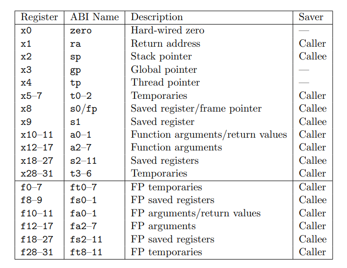
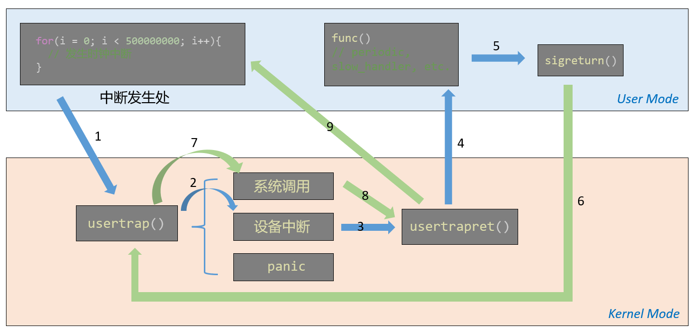

## Lab: traps

> This lab explores how system calls are implemented using traps. You will first do a warm-up exercises with stacks and then you will implement an example of user-level trap handling.

本 lab 旨在了解 RSIC-V 汇编指令集和 xv6 的 trap 机制，个人认为很重要，能学到的东西很多。实验主要围绕 Lecture 5、Lecture 6 和 xv6 book Chapter 4 展开，虽然只有两个子实验，代码量小，但是涉及到的理论知识很多很细。因此，本实验主要以阅读 Lecture 和 xv6 book 相关内容以学习理论知识为主，不要光想着过点。

如果不去阅读相关参考资料，实验会无从下手，即使误打误撞过了也毫无意义。不同于前几个 lab，本 lab 需要观看课程的 Lecture，其会很详细的介绍 RISC-V 指令集概要、RISC-V 常用寄存器、RISC-V 栈空间、Trap 相关等知识点，非常推荐。不过视频是纯英文的，这里要感谢 huihongxiao 大佬把所有的 Lecture 全部翻译为中文文档，起到了很大的扫盲作用。

- [Lecture 05: Calling conventions and stack frames](https://github.com/huihongxiao/MIT6.S081/tree/master/lec05-calling-conventions-and-stack-frames-risc-v)
- [Lecture 06: Isolation and system call](https://github.com/huihongxiao/MIT6.S081/tree/master/lec06-isolation-and-system-call-entry-exit-robert)

读完上述两个 Lecture，对实验的大方向就了解了，接着看一下 [xv6 book](https://pdos.csail.mit.edu/6.828/2022/xv6/book-riscv-rev3.pdf) 的 Chapter 4 学习一下 trap 和 system call 的机制即可。

### RISC-V 寄存器

在 Lecture 5.4 中介绍了 RISC-V 的相关寄存器，如下：



在谈到寄存器的时候，我们会用它们的 ABI 名字，不仅是因为这样描述更清晰和标准，同时也因为在写汇编代码的时候使用的也是ABI名字。第一列中的寄存器名字并不是超级重要，它唯一重要的场景是在 RISC-V 的 Compressed Instruction 中。RISC-V中通常的指令是 64bit，但是在 Compressed Instruction 中指令是 16bit。在 Compressed Instruction 中我们使用更少的寄存器，也就是 x8 - x15 寄存器。同样的，s1 和 s2-s11 分开列出，是因为 s1 在 Compressed Instruction 中有效，而 s2-s11 无效。a0-a7 用来存放函数调用的参数，如果一个函数超过 8 个参数，就需要用内存了。

Caller Saver 和 Callee Saver 是什么意思？

- Caller Saved 寄存器在函数调用的时候不会保存；
- Callee Saved 寄存器在函数调用的时候会保存；

通俗点讲，一个 Caller Saved 寄存器可能被其他函数重写。举个例子，ra 寄存器是 Caller Saved ，当函数 a 调用函数 b 的时侯，b 会重写 ra 寄存器，存放 a 的地址用作返回。

### RISC-V 函数栈结构

在 Lecture 5.4 中介绍了 RISC-V 的函数栈，如下图所示：


其中每一格为 8 字节（64 bit），一个 Stack Frame 称为一个函数栈空间，每一个函数均有自己独立的 Stack Frame，并且调用链之间的 Stack Frame 是连续的，这点从函数的序言中可以看出。fp 指向 Stack Frame 的首址，sp 指向 Stack Frame 的最低地址。Return Address（ra） 和 To Prev.Frame(fp) 在每个 Stack Frame 中位置固定，前者存放调用者的 pc，后者存放调用者的 fp。需要注意，栈的生长是从高到低，但是取址是从低到高，因此 Return Address 的栈指针是 fp - 8，相应的，Prev 为 fp - 16。

如果一个函数调用了另一个函数，那么该函数的汇编中会有 `序言` 和 `后记`。在序言中，对 sp 减去 16，即为子函数创造栈空间，并将 ra 存进相关位置。

知道这些就可以写前两个子实验了，因为没有涉及到 trap。

### RISC-V assembly (easy)

不用写代码，回答下述问题。

> Which registers contain arguments to functions? For example, which register holds 13 in main's call to `printf`?

- a0 ~ a7 存放函数的参数，且编号越小存放越往左的参数。比如在 printf 中，a2 存放参数 13，a1 存放 f(8)+1 的结果 12，a0 存放格式化字符串的首址。汇编如下：

- ```assembly
  printf("%d %d\n", f(8)+1, 13);
  24:	4635                	li	a2,13
  26:	45b1                	li	a1,12
  28:	00000517          	auipc	a0,0x0
  2c:	7c850513          	addi	a0,a0,1992 # 7f0 <malloc+0xe8>
  30:	00000097          	auipc	ra,0x0
  34:	61a080e7          	jalr	1562(ra) # 64a <printf>
  ...
  ```

- 问题的答案在 Lecture 5 中有原话，翻译过来就是：a0 到 a7 寄存器是用来作为函数的参数，如果一个函数有超过 8 个参数，我们就需要用内存了。

>  Where is the call to function `f` in the assembly code for main? Where is the call to `g`? (Hint: the compiler may inline functions.)

- 没有跳转，被编译器 inline 了。正常情况下，main 在调用 printf 之前，应该是要通过 jalr 跳转到 f 的首址的，同样的 f 也要跳转到 g 去。但这里没有这样的语句，而是直接算出了结果 12，这是因为 g 被 inline 进 f 了，同时 f 也被 inline 进了 main。

> At what address is the function `printf` located?

- 0x30+0x61a=0x64a。由如下跳转命令所得：

- ```assembly
  30:	00000097          	auipc	ra,0x0
  34:	61a080e7          	jalr	1562(ra) # 64a <printf>
  ```

- 首先，RISC-V 的 () 运算符是加立即数的操作，1562(ra) <=> ra + 1562。auipc 和 jalr 为常用的跳转命令组合。其中 `auipc a, i` 指将 i 左移 12 位然后和 pc 相加，值赋给寄存器 a，`jalr a` 指无条件跳转到 a 所存地址处。这里进行 auipc 时 pc == 0x30，i = 0，因此 ra == 0x30，故最终跳转位置为 0x30 + 0x61a(1562) = 0x64a，即 printf 的地址。

> What value is in the register `ra` just after the `jalr` to `printf` in `main`?

- 0x34 + 4 = 0x38。auipc 通过 ra 来存储返回地址，其在更新 pc 为跳转地址之前，将当前 pc + 4 赋值给 ra，即返回处的指令地址。

> Run the following code.
>
> ```
> 	unsigned int i = 0x00646c72;
> 	printf("H%x Wo%s", 57616, &i);
> ```
>
> What is the output? [Here's an ASCII table](https://www.asciitable.com/) that maps bytes to characters.
>
> The output depends on that fact that the RISC-V is little-endian. If the RISC-V were instead big-endian what would you set `i` to in order to yield the same output? Would you need to change `57616` to a different value?
>
> [Here's a description of little- and big-endian](http://www.webopedia.com/TERM/b/big_endian.html) and [a more whimsical description](https://www.rfc-editor.org/ien/ien137.txt).

- He110 World。%x 输出 57616 的十六进制格式 110，%s 输出以 &i 为首址的字符串，因为是小端对齐，所以从低地址到高地址依次是 "0x72"、"0x6c"、"0x64"，遇 0 结尾，即 "rld" 。若为大端对齐，i 需要改为 0x726c6400， 57616 不需要改。

> In the following code, what is going to be printed after `'y='`? (note: the answer is not a specific value.) Why does this happen?
>
> ```
> 	printf("x=%d y=%d", 3);
> ```

- 取决于寄存器 a2 的值，上述指令需要读取 a1 和 a2 的参数，a1 为 3，a2 没有传入，用 gdb 看一下 a2 的值为多少即可。

### Backtrace (moderate)

> For debugging it is often useful to have a backtrace: a list of the function calls on the stack above the point at which the error occurred. To help with backtraces, the compiler generates machine code that maintains a stack frame on the stack corresponding to each function in the current call chain. Each stack frame consists of the return address and a "frame pointer" to the caller's stack frame. Register `s0` contains a pointer to the current stack frame (it actually points to the the address of the saved return address on the stack plus 8). Your `backtrace` should use the frame pointers to walk up the stack and print the saved return address in each stack frame.

本实验要实现一个内核函数 backtrace，该函数用来回溯调用者的函数调用链，将所有的调用者的 pc 打印出来，也就子函数的 ra。只需要从当前 Stack Frame 开始，通过 Prev 找到调用者的 Stack Frame，直至调用链结束为止。

首先，要获取到当前 Stack Frame 的 fp，这个它已经帮我们写了，在 `kernel/riscv.h` 中添加函数：

```c
// kernel/riscv.h
static inline uint64
r_fp()
{
  uint64 x;
  asm volatile("mv %0, s0" : "=r" (x) );
  return x;
}
```

接下来，在 `kernel/printf.c` 中实现 backtrace，调用 r_fp 来获得栈指针 fp，打印出 *(fp - 8)，然后跳转到 *(fp - 16) 即可，以此循环。那么问题来了，循环结束点（最后一个 Stack Frame）在哪呢？

> Your `backtrace()` will need a way to recognize that it has seen the last stack frame, and should stop. A useful fact is that the memory allocated for each kernel stack consists of a single page-aligned page, so that all the stack frames for a given stack are on the same page. You can use `PGROUNDDOWN(fp)` (see `kernel/riscv.h`) to identify the page that a frame pointer refers to

整个栈空间是有个范围的，所有的函数的 Stack Frame 均在其中，并且每一个栈指针都是 4k 对齐的，因此如果 fp 不是 4k 地址对齐，那么就说明超过范围了。xv6 中通过宏 PGROUNDUP 和 PGROUNDDOWN 分别进行向上对齐和向下对齐，可以通过他们检验 fp 的正确性。代码如下：

```c
// kernel/printf.c
void backtrace()
{
  uint64 fp = r_fp();
  uint64 up = PGROUNDUP(fp);
  uint64 down = PGROUNDDOWN(fp);
  while(fp < up && fp > down){
    uint64 ra = fp - 8;
    uint64 pre = fp - 16;
    printf("%p\n",*(uint64*)ra);
    fp = *(uint64*)pre;
  }
}
```

此外，实验要求，在发生 panic 时调用 backtrace，因此在 panic 中添加调用：

```c
// kernel/printf.c
void
panic(char *s)
{
  pr.locking = 0;
  printf("panic: ");
  printf(s);
  printf("\n");
  panicked = 1; // freeze uart output from other CPUs
  backtrace();
  for(;;)
    ;
}
```

make qemu 后运行 bttest，打印出三个函数的首址：

```shell
$ bttest
0x000000008000212c
0x000000008000201e
0x0000000080001d14
```

另开一个终端运行 addr2line -e kernel/kernel，结果如下，为三个函数所在文件：

```shell
ubuntu@ubuntu:~/xv6-labs-2022$ addr2line -e kernel/kernel
0x000000008000212c
/home/ubuntu/xv6-labs-2022/kernel/sysproc.c:60
0x000000008000201e
/home/ubuntu/xv6-labs-2022/kernel/syscall.c:141
0x0000000080001d14
/home/ubuntu/xv6-labs-2022/kernel/trap.c:76
```

### Alarm (hard)

> In this exercise you'll add a feature to xv6 that periodically alerts a process as it uses CPU time. This might be useful for compute-bound processes that want to limit how much CPU time they chew up, or for processes that want to compute but also want to take some periodic action. More generally, you'll be implementing a primitive form of user-level interrupt/fault handlers; you could use something similar to handle page faults in the application, for example. Your solution is correct if it passes alarmtest and 'usertests -q'

本 lab 开始进行 trap 相关实验，虽然标的是 hard，但读完 [Lecture 6](https://github.com/huihongxiao/MIT6.S081/tree/master/lec06-isolation-and-system-call-entry-exit-robert) 后就会发现很简单，顶多一些细节问题，但一定要去读相关 Lecture，不然根本做不动吗，。

trap 共分为三类：

- **系统调用**；
- 程序出现了类似page fault、运算时除以0的错误，即 **panic**；
- 一个设备触发了**中断**使得当前程序运行需要响应内核设备驱动；

trap 的流程这里就不赘述了， [Lecture 6](https://github.com/huihongxiao/MIT6.S081/tree/master/lec06-isolation-and-system-call-entry-exit-robert) 中讲的非常详细。本 lab 一共涉及两类 trap，分别为系统调用和时钟中断，核心围绕在 如何进入 trap handle、如何保存寄存器、如何返回用户态等等。

本 lab 的直接要求时实现 sigalarm，什么意思呢？就是当进程调用 sigalarm 时，就会按照 CPU 时钟来定时的执行某一个函数。比如，proc1 调用了 sigalarm(2, func)， 那该进程就会每隔 2 个 CPU 时钟调用一次 func。一共分为 test0、test1、test2、test3，又浅入深的逐步实现该操作。

#### test0

该测试点用来实现如何指定 trap 的返回地址。我们知道，trap 的全过程中，是在 usertrap() 中通过将 epc 保存在 trapframe 中，然后 usertrapret 时重放 trapframe 来做到返回到调用者处的。而在该测试点中，要求更改 p->trapframe->epc，指向任意函数，使得 trap 不按照原路返回，而是到指定函数处。测试代码如下：

```c
void
periodic()
{
  count = count + 1;
  printf("alarm!\n");
  sigreturn();
}

// tests whether the kernel calls
// the alarm handler even a single time.
void
test0()
{
  int i;
  printf("test0 start\n");
  count = 0;
  sigalarm(2, periodic);
  for(i = 0; i < 1000*500000; i++){
    if((i % 1000000) == 0)
      write(2, ".", 1);
    if(count > 0)
      break;
  }
  sigalarm(0, 0);
  if(count > 0){
    printf("test0 passed\n");
  } else {
    printf("\ntest0 failed: the kernel never called the alarm handler\n");
  }
}
```

虽然涉及到了系统调用和时钟中断，但 test0 主要还是时钟中断，系统调用只是起到一个标记作用，为什么这么说呢，看接下来的实现就知道了。sys_sigalarm 的注册就省略了。

首先，在 proc 结构中加入三个字段，分别存储 sigalarm 指定的周期、自上一次调用以来的CPU时钟滴答数、func 函数地址。这些在 Lab guide 中有提示：

> Your `sys_sigalarm()` should store the alarm interval and the pointer to the handler function in new fields in the `proc` structure
>
> You'll need to keep track of how many ticks have passed since the last call (or are left until the next call) to a process's alarm handler; you'll need a new field in `struct proc` for this too

```c
// kernel/proc.c
struct proc {
  // ...
  int alarm_ticks;
  int expired_ticks;
  uint64 fn;
}
```

而 sys_sigalarm 要做的，只是给 alarm_ticks 和 fn 赋值而已：

```c
// kernel/sysalarm.c
uint64
sys_sigalarm(void){
  int n;
  uint64 fn;
  argint(0, &n);
  argaddr(1, &fn);
  struct proc* p = myproc();
  acquire(&p->lock);
  p->expired_ticks = 0;
  p->alarm_ticks = n;
  p->fn = fn;
  release(&p->lock);
  return 0;
}
```

那么什么时候触发跳转呢？这就是时钟中断的活了。每过一个 CPU 时钟滴答，都会产生一个时钟中断，既然如此，它就会跳转到 usertrap() 中。usertrap() 的三个分支分别处理三种不同的中断，而时钟中断位于分支 ` if(which_dev == 2)` 中，因此只需在其中做手脚即可。

一旦滴答数超过预期，那么就将 p->trapframe->epc 赋值为 func 地址，因为 p->trapframe->epc 存储的是 trap 的返回地址，因此就实现了时钟中断后返回到 func 的操作。注意，func 是用户态的，是当 trap 从内核态返回到用户态时的目的函数。usertrap 代码如下：

```c
// kernel/trap.c
void
usertrap(void)
{
  // ...
  // give up the CPU if this is a timer interrupt.
  if(which_dev == 2){
    // lab4
    acquire(&p->lock);
    p->expired_ticks ++;
    if(p->alarm_ticks != 0 && p->expired_ticks >= p->alarm_ticks && p->fn_ret){
      p->expired_ticks = 0;
      p->trapframe->epc = p->fn;
    }
    release(&p->lock);
    yield();
  }
}
```

注意传入的 func 函数，发现会调用 sigreturn 系统调用，它的作用很重要，不过 test0 不需要它，这里就先让 sys_sigreturn 返回个 0 就行。

> For now, your `sys_sigreturn` should just return zero.

```c
// kernel/sysalarm.c
uint64
sys_sigreturn(void){
  return 0;
}
```

以上就是 test0 要求的主要内容，其余细节问题（比如 allocproc 初始化字段、定义用户态调用函数等等）这里就不赘述了。总而言之，test0 完成的就是让时钟中断可以返回到指定函数处，那么问题来了，如果修改 p->trapframe->epc，那么怎么返回到原处（发生时钟中断的代码处）呢？是的，返回不了。所以仅靠 test0 实现的部分是远远不够的，test1 就要完成返回原处的任务。

#### test1

该测试点用来让完成 func 后，能返回到时钟中断发生的位置。但是，这种返回实际上新的一个 trap，即系统调用 sigreturn。从时钟中断开始，整个过程进行了两个来回，用户态-> 内核态->用户态->内核态->用户态，用图表示如下：



因此，需要在 proc 中存储中断发生处的 epc（+4），即更改前的 p->trapframe->epc，然后在 sigreturn 处将其重新赋值给 p->trapframe->epc，使整套流程正常返回。

但是，上述操作只能让返回正确进行，但返回之后却一塌糊涂，因为寄存器全都被覆盖了。因此，除了保存时钟中断发生时的 epc，还要保存当时的所有寄存器，这些寄存器都暂存在 trapframe，因此备份覆盖之前的 trapframe 即可。在 proc 中定义一个字段用来备份 trapframe：

```c
// kernel/proc.h
struct proc {
  // ...
  int alarm_ticks;
  int expired_ticks;
  uint64 fn;
  struct trapframe *trapframe_backup;  // new
}
```

注意，要在 allocproc() 时为该字段分配内存，并在 freeproc() 时给这片内存 free 了，代码略。在 usertrap 更改 trapframe 之前，将其进行备份：

```c
// kernel/trap.c
void
usertrap(void)
{
  // ...
  if(which_dev == 2){
    // lab4
    acquire(&p->lock);
    p->expired_ticks ++;
    if(p->alarm_ticks != 0 && p->expired_ticks >= p->alarm_ticks && p->fn_ret){
      memmove(p->trapframe_backup, p->trapframe, sizeof(struct trapframe)); // new
      p->expired_ticks = 0;
      p->trapframe->epc = p->fn;
    }
    release(&p->lock);
    yield();
  }
}
```

然后在 sys_sigreturn 中将其恢复即可：

```c
uint64
sys_sigreturn(void){
  struct proc* p = myproc();
  acquire(&p->lock);
  memmove(p->trapframe, p->trapframe_backup, sizeof(struct trapframe));
  release(&p->lock);
  return 0;
}
```

至此，一套完整的 trap 返回流程就完成了。

#### test2

test2 新增了要求，在 func 在执行的时候，接下来的时钟中断无法再执行 func，也就是 proc 一次只能被时钟触发一个 func。

实现很简单，方法也很多，这里我是通过 flag 记录 func 是否已经返回。然后在时钟滴答数满足条件时进行判断，如果 flag 为 true 则说明已经返回，可以跳转，反之则直接跳过。注意在 allocproc 时将 flag 初始化为 true。不过难受的是，xv6 没有 bool 类型，只能用 int 代替了。

```c
struct proc {
  // lab 4
  int alarm_ticks;
  int expired_ticks;
  uint64 fn;
  struct trapframe *trapframe_backup;
  int fn_ret; // 1-ret, 0-not ret
}

static struct proc*
allocproc(void){
  // ...
  p->fn_ret = 1;
}
```

在 usertrap 中多一层判断，一旦进入，就将其设为 false（not ret）：

```c
void
usertrap(void)
{
  // ...
    if(p->alarm_ticks != 0 && p->expired_ticks >= p->alarm_ticks && p->fn_ret){
      memmove(p->trapframe_backup, p->trapframe, sizeof(struct trapframe));
      p->expired_ticks = 0;
      p->fn_ret = 0;  // new
      p->trapframe->epc = p->fn;
    }
  // ...
}
```

接下来就是何时将其设为 true 了。起初，我是想在 usertrapret 中设置的，但这样会影响所有的 trap，显然是不合适的。最后，我在 sys_sigreturn 中将其复位。

```c
// kernel/sysalarm.c
uint64
sys_sigreturn(void){
  struct proc* p = myproc();
  acquire(&p->lock);
  p->fn_ret = 1;  // new
  memmove(p->trapframe, p->trapframe_backup, sizeof(struct trapframe));
  release(&p->lock);
  return 0;
}
```

至此，test2 完成。

#### test3

test3 是 6.1810 才有的，6.S081 没有整个，说实话，我没明白这个测试的意义何在。

> Make sure to restore a0. `sigreturn` is a system call, and its return value is stored in a0

先看测试代码：

```c
void
test3()
{
  uint64 a0;

  sigalarm(1, dummy_handler);
  printf("test3 start\n");

  asm volatile("lui a5, 0");
  asm volatile("addi a0, a5, 0xac" : : : "a0");
  for(int i = 0; i < 500000000; i++)
    ;
  asm volatile("mv %0, a0" : "=r" (a0) );

  printf("a0: %d\n",a0);

  if(a0 != 0xac)
    printf("test3 failed: register a0 changed\n");
  else
    printf("test3 passed\n");
}
```

测试点的意思是，要在返回到 trap 发生处时，恢复 a0，我不理解这么做的意义。首先，trapframe 中的寄存器基本都是 trap 发生之前的用户态寄存器，但是 a0 不是。在进行系统调用时，trapframe->a0 会被更改，用来存放系统调用的返回值，这一操作发生在 syscall 中：

```c
// kernel/syscall.c
void
syscall(void)
{
  // ...
  p->trapframe->a0 = syscalls[num]();
  // ...
}
```

因此，当系统调用返回时，a0 就是系统调用的返回值。现在，测试点想要保存 trap 发生之前的 a0，饼在返回后恢复。保存很容易做到，proc 加个字段备份即可。但是恢复呢？直接恢复的话也很简单，在 usertrapret 中更改 trapframe->a0 即可，但是系统调用的返回值存在哪呢？也就是说，a0 本身的作用就是存放系统调用的返回值，这里要把它给恢复了，有点不解。如果在 usertrapret 中进行恢复，那么影响的就是所有的系统调用，他们的返回值都无处存放了。

我选择的解决办法是，不去备份 a0，而是让 sigreturn 直接返回原有的 a0，这样 a0 就还是 trap 发生时的，如此做只会影响 sigreturn，不会涉及到其余系统调用。

```c
uint64
sys_sigreturn(void){
  struct proc* p = myproc();
  acquire(&p->lock);
  p->fn_ret = 1;
  memmove(p->trapframe, p->trapframe_backup, sizeof(struct trapframe));
  release(&p->lock);
  return p->trapframe->a0;  // new
}
```

但说实话，我不明白这么做的意义是啥。