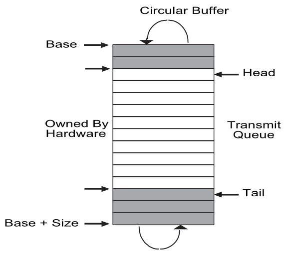

## Lab: network driver

> You'll use a network device called the E1000 to handle network communication. To xv6 (and the driver you write), the E1000 looks like a real piece of hardware connected to a real Ethernet local area network (LAN). In fact, the E1000 your driver will talk to is an emulation provided by qemu, connected to a LAN that is also emulated by qemu. On this emulated LAN, xv6 (the "guest") has an IP address of 10.0.2.15. Qemu also arranges for the computer running qemu to appear on the LAN with IP address 10.0.2.2. When xv6 uses the E1000 to send a packet to 10.0.2.2, qemu delivers the packet to the appropriate application on the (real) computer on which you're running qemu (the "host")

说实话，这个 lab 对我而言是有难度，难的不在思想，而是对 E1000 的使用。本 lab 只有一个任务，就是实现 xv6 对链路帧的处理，也就网络模型中的链路层，方式是使用网卡 E1000。本 lab 没有去看 Lecture 的必要，因为其中讲的都是基础的计网知识，也没有看 xv6 book 的必要，唯独需要看的，是 [E1000 手册](https://pdos.csail.mit.edu/6.828/2022/readings/8254x_GBe_SDM.pdf)，不看根本做不了，整整 410 页，我人麻了。

为了一个实验把 410 页全看完不现实，指导书也说了，着重看 5 章即可：

> - Section 2 is essential and gives an overview of the entire device.
> - Section 3.2 gives an overview of packet receiving.
> - Section 3.3 gives an overview of packet transmission, alongside section 3.4.
> - Section 13 gives an overview of the registers used by the E1000.
> - Section 14 may help you understand the init code that we've provided.

然后哪怕这五章内容也不少，因此我是结合了 E1000 手册和网上博客一同学习的，最后基本完成了实验。在进行实验之前，一定要先搞清楚三个事情：

1. xv6 收发网络包的调用链，从网络层到链路层；
2. E1000 收发链路帧的模型，DMA 模型；
3. E1000 的使用，主要在于各种寄存器；

### xv6 网络调用链

首先是发送调用链。

Linux 万物皆文件，xv6 亦是如此。上层若想发送网络包，那就要通过系统调用 sys_write() 来写“文件”。接着，调用 filewrite() ，其在最后会判断写入的文件类型是不是套接字（FD_SOCK）。如果是，那么就调用 sockwrite() ，至此运输层开始。sockwrite() 会给报文分配一个空间用于写数据，接着调用 net_tx_udp() 来进行 UDP 封装，封装完成后进一步调用 net_tx_ip() 进行 IP 封装，随后进一步调用 net_tx_eth() 进行链路层封装。最后，通过调用 e1000_transmit() 来使用 E1000 发送链路帧，这部分需要我们自己实现，后面就是硬件的活了。上述函数都是嵌套调用的，故 xv6 发包的流程如下：

```c++
sys_write() -> filewrite() -> sockwrite() -> net_tx_udp() -> net_tx_ip() -> net_tx_eth() -> e1000_transmit()
```

然后是接收调用链。

要明白 xv6 是如何知道 E1000 收到链路帧了，是通过中断。每当 E1000 收到一个链路帧时，就会触发对应的硬件中断。在 usertrap()，会通过 devintr() 来进入硬件中断处理入口。devintr() 会先判断硬件中断的类型，如果是 E1000_IRQ，就说明是 E1000 产生的中断，接着进入 e1000_intr() 处理该中断。随后，调用 e1000_recv() 来处理介绍到的链路帧，这部分需要我们自己实现，个人认为接收比发送要难。 e1000_recv() 中会调用 net_rx() 对链路帧进行解封装，并将其递交给网络层。之后，根据包类型调用 net_rx_ip() 或是 net_rx_arp() 来进一步向上递交，前者是 IP 报文后者是 ARP 报文。对于 IP 报文，进一步调用 net_rx_udp() 将其解封装为 UDP 报文。随后，调用 sockrecvudp()，其会进一步调用 mbufq_pushtail() 来将报文放入一个接收队列。此后，上层就可以通过 sockread() 来从队列中读出该报文了。而对于 ARP 报文，其本身不再有运输层报文，因此不会向上递交，而是会调用 net_tx_arp() 来进行一个 ARP 回复。故 xv6 收包的流程如下：

```c++
e1000_intr() -> e1000_recv() -> net_rx() -> net_rx_ip() -> net_rx_udp() -> sockrecvudp() -> mbufq_pushtail()
```

### E1000 收发模型

E1000 使用 DMA 模型（Direct Memory Access），也就是内存直接访问。在学计网的时候我们知道，任何处理网络包的终端都会有一个缓冲区，这是该硬件自带的，E1000 也不例外。但是，E1000 自带的空间毕竟太小了，因此 E1000 将会直接使用主机内容来作缓冲区，也就是内存直接访问。这也是为什么，在实现代码时会发现，所有的包空间都是最终都是通过 kalloc 来分配空间的。

**发送模型**

从代码中可以看出，我们有两个结构体需要重点注意：`mbuf`、`tx_desc`。而他们各自又有着自己的队列，名为 `tx_mbufs`、`tx_ring`。四个的作用如下：

- **mbuf**：内存中存放报文的空间；
- **tx_desc**：上述 mbuf 的描述符，可以理解为指向它具体内容的指针；
- **tx_mbufs**：mbuf *地址* 组成的队列，以 desc 的 idx 作为索引，用于标识后续要释放的空间；
- **tx_ring**：tx_desc 组成的队列；

而 E1000 的发送模型，主要围绕 tx_ring 来进行。简单地讲，流程如下。

要被发送的报文会先被分配一块空间，也就是 mbuf，里面存放着报文的内容，这些空间在 heap 中，因此是不连续的。而每一个 mbuf 都会被一个 tx_desc 指向，tx_desc 被连续的放进 tx_ring 队列中。因此，不连续的报文空间因为 tx_ring 的存在，可以被连续地访问。

那么问题来了。tx_mbufs 是干啥的？tx_mbufs 中的每个元素都是一个 tx_desc 对应的 mbuf 的首址。通俗的将，第 i 个 tx_desc 指向的 mbuf 的首址就是 mbufs[i]。那就奇怪了，明明 tx_desc 已经指向了 mbuf 了，为什么还需要一个队列来专门标明呢？看一下 tx_desc 指向的内容就明白了：

```c++
struct mbuf {
  struct mbuf  *next; // the next mbuf in the chain
  char         *head; // the current start position of the buffer
  unsigned int len;   // the length of the buffer
  char         buf[MBUF_SIZE]; // the backing store
};
// ...
tx_desc->addr = (uint64)m->head;
```

其中，head 指向的缓冲区 buf 的头部。实际上，tx_desc->addr 就是这个 head，而不是 mbuf 的首址，因此，我们额外记录每个 tx_desc 对应的 mbuf 首址，这就是 mbufs 的内容。而为什么要记录首址呢？答案是为了释放。当第 i 个 tx_desc 处理完后，对应的 mbuf 就要被释放，而 tx_desc->addr 并不是 mbuf 的首址，因此不能通过其释放，需要通过 tx_mbufs[i] 来释放。因此，整个发送模型的核心就是 tx_ring。

根据开发手册 3.4 节描述的发送描述符的队列结构. 这其中涉及了队列在内存的地址和长度 E1000_TDBAL E1000_TDLEN，队列的首尾指针 E1000_TDH E1000_TDT，这些变量都在对应的寄存器中，可由 regs 数组进行访问。在 kernel/e1000.c 的 e1000_init() 函数中，会进行发送初始化，会对以上变量进行初始化。开发手册对该模型用下图表示：



其中, 最需要关注的是发送队列的首尾指针 `E1000_TDH` 和 `E1000_TDT`。 根据开发手册 3.4 节，发送首指针指向以及载入输出队列的数据,，由网卡**硬件维护**并更新该指针。而发送尾指针则指向第一个软件可以写入的描述符的位置，即由网卡驱动**软件维护**该指针。

**接收模型**

与发送模型对应的结构相同，接收模型也有 `mbuf`、`rx_desc`、`rx_bufs` 和 `rx_ring`。不同于发送模型中 mbuf 的空间需要我们自己分配，在接收模型中，mbufs 的每一个元素对应空间都已经被分配好了，用于存放接收到的报文。mbufs 中何时被放入了数据包我们不管，只需要按照 rx_ring 的顺序依次处理这些 mbuf 并将其递交给上层即可。

相对应的，rx_mbufs 的作用和 tx_mbufs 的作用也不同。发送缓冲区队列 tx_mbufs  初始时全为空指针，而缓冲区 mbuf 实际由 sockwrite() 分配，在最后时绑定到缓冲区队列中, 主要是为了方便后续释放缓冲区。而接收缓冲区队列 rx_mbufs  在初始化时全部都已分配，由内核解封装后释放内存。当 rx_mbufs 中的一个 mbuf 被处理完毕后，需要替换成一个新的缓冲区用于下一次硬件接收数据。

我们需要取得 rx_ring 中首个未处理（未递交）的报文，通过 `(regs[E1000_RDT]+1)%RX_RING_SIZE` 来确定（tail + 1）。注意，这里不是队列尾，而是队列尾 +1。对于发送模型而言，队列尾是下一个待处理的报文，而对于接收模型而言，队列尾是当前在处理的，而队列尾 +1才是下一个待处理的报文们。这一点在手册中有说明，在指导书中也有提示：

> TX: Finally, update the ring position by adding one to `E1000_TDT` modulo `TX_RING_SIZE`.
>
> RX: by fetching the `E1000_RDT` control register and adding one modulo `RX_RING_SIZE`.

需要注意的是，在实验指导中指出可能之前到达的数据包超过队列待处理大小，需要进行处理。也就是说，处理包的速度比接收包的速度慢，导致 tail + 1 之后还有一些包未处理。这里我参考了其他人的做法，在 e1000_recv() 添加循环，tail 一直往后推，从而让一次中断触发后网卡软件会一直将可解封装的数据传递到网络栈，以避免队列中的可处理数据帧的堆积来避免上述情况。而终止条件即当前描述符的 DD 标志位未被设置，则证明当前数据还未由硬件处理完毕。

### 代码实现

实现上参考了 [博客](https://blog.csdn.net/LostUnravel/article/details/121437373) 的内容，博客帮我理清了 E1000 的收发流程，还提示了一些细节问题，比如内存屏障，我自己就没想到。

**e1000_transmit**

```c++
int
e1000_transmit(struct mbuf *m)
{
  //
  // Your code here.
  //
  // the mbuf contains an ethernet frame; program it into
  // the TX descriptor ring so that the e1000 sends it. Stash
  // a pointer so that it can be freed after sending.
  //
  acquire(&e1000_lock);
  uint32 tdt = regs[E1000_TDT]; // 队列尾
  struct tx_desc *desc = &tx_ring[tdt];

  // 检查队列是否已满，通过 E1000_TXD_STAT_DD
  if(!(desc->status & E1000_TXD_STAT_DD)){
    release(&e1000_lock);
    return -1;
  }

  // 释放 desc 指向的原内存
  if(tx_mbufs[tdt]){
    mbuffree(tx_mbufs[tdt]);
  };

  // m 记录在 mbufs，用于之后释放
  tx_mbufs[tdt] = m;

  // desc 指向 m
  desc->addr = (uint64)m->head;
  desc->length = m->len;
  desc->cmd = E1000_TXD_CMD_EOP | E1000_TXD_CMD_RS;

  // // 内存屏障
  // __sync_synchronize();

  // 更新尾指针寄存器
  regs[E1000_TDT] = (tdt + 1) % TX_RING_SIZE;
  release(&e1000_lock);

  return 0;
}
```

注意点：

- 检查尾指针指向的描述符是否在状态中写入了 E1000_TXD_STAT_DD标志位。根据开发手册 3.3.3.2 节关于 DD 标志位的描述，该标志位会在描述符的数据被处理完成后设置。因此未设置该标志位的描述符其数据仍未被硬件完成传输，因此此时还不能进行数据写入，返回失败。这里实验指导中携带是检查"溢出(overflowing)"，但是并未通过检查队满条件 (Tail+1)%Size==Head 判断的，而是通过 DD 标志位，根据开发手册，Head 指向的是由硬件所有的描述符的起始位置，等待发送，其 DD 标志位理论上还未被设置，所以若遇到 DD 位未被设置的描述符，则可说明队列已满。
- 更新尾指针指向的描述符的 addr 字段指向数据帧缓冲区的头部 m->head；length 字段记录数据帧的长度 m->len。在上文也提到过，e1000_transmit() 是网络栈最后进行调用，在上层 sockwrite() 中分配的缓冲区 m，同时在一层层封装时会更新缓冲区头部（首地址）的位置字段 m->head。
- 更新尾指针指向的描述符的 `cmd` 字段。在 `kernel/e1000_dev.h` 中，关于描述符 command 定义了 `E1000_TXD_CMD_EOP` 和 `E1000_TXD_CMD_RS` 两个标志位。实际上，在手册中介绍了很多标志位，但 xv6 代码框架并没有提供，只提供了上面两个，因此很容易想到就用这两个。具体而言，
- 根据开发手册 3.3.3.1 节，容易判断出 EOF 标志位表示数据包的结束，因此需要被设置。而再结合 3.3.3.2 节 “The transmit descriptor status field is only present in cases where RS (or RPS for the 82544GC/EI only) is set in the command field”，和 3.4 节 “Software can determine if a packet has been sent by setting the RS bit (or the RPS bit for the 82544GC/EI only) in the transmit descriptor command field”，可以判断出 RS 字段用于报告状态信息，只有设置了该字段，描述符的 status 字段才是有效的，而网卡将数据包发送完成后会设置 DD 状态，因此此处也需要对描述符设置 RS 标志位。
- 在更改寄存器前通过 `__sync_synchronize()` ，这是为了防止编译器错误的重排指令。在 C 编译时，编译器会基于优化的考虑重排指令从而加速运行，当然在软件层面这不会导致问题。但是，编译器不会识别存在的硬件隐患，因此指令重排可能将 regs[E1000_TDT] 寄存器的设置给排到前面去了，这显然是错的。所以要在 regs[E1000_TDT] 设置之前放置内存屏障，从而保证所有操作执行完毕后才能设置该寄存器。
- 上文提到过，e1000_transmit() 的源头是 sys_write()，因此可能多线程调用，故出于同步的考量，要进行加锁。

**e1000_recv**

```c++
static void
e1000_recv(void)
{
  //
  // Your code here.
  //
  // Check for packets that have arrived from the e1000
  // Create and deliver an mbuf for each packet (using net_rx()).
  //
  // 不能加锁，因为 net_tx_arp() 中加了，此处再加就会死锁
  //acquire(&e1000_lock);
  uint32 rdt = regs[E1000_RDT];
  uint32 tail = (rdt + 1) % RX_RING_SIZE;
  struct rx_desc *desc = &rx_ring[tail];
  while(desc->status & E1000_RXD_STAT_DD){
    if(desc->length > MBUF_SIZE) {
      panic("e1000 len");
    }
    // 更新长度
    rx_mbufs[tail]->len = desc->length;

    // 将包递交给网络栈
    net_rx(rx_mbufs[tail]);

    // 分配一块新的缓冲区用于硬件下一次放包
    rx_mbufs[tail] = mbufalloc(0);
    if(!rx_mbufs[tail]){
      panic("e1000_recv mbufalloc failed");
    }
    desc->addr = (uint64)rx_mbufs[tail]->head;
    desc->status = 0;

    tail = (tail + 1)%RX_RING_SIZE;
    desc = &rx_ring[tail];
  }
  regs[E1000_RDT] = (tail - 1) % RX_RING_SIZE;
  //release(&e1000_lock);
}
```

注意点：

- 待处理的包位于 tail + 1，这点和发送数据不一样。
- 如前文所述，通过 while 循环让一次中断触发后网卡软件会一直将可解封装的数据传递到网络栈，以避免队列中的可处理数据帧的堆积。
- 这里不能加锁，否则会报错。这是因为后续调用 net_rx() 时，会有一个分支走 net_rx_arp()，而在这个函数中调用了 acquire(&lock)，因此如果在 e1000_recv() 申请锁，那就会出现持有锁的情况下再次申请锁，就会出错。个人认为 xv6 这里写的不合适，锁应该加在 e1000_recv() 处，而非 net_rx_arp() 处。

### 未解决的问题

在测试 nettests 时出现错误：`invalid name for EDNS`

- 问题位于测试 nettests 中对收到的 DNS 进行 addtional record 检查部分：

- ```c++
    // needed for DNS servers with EDNS support
    for(int i = 0; i < ntohs(hdr->arcount); i++) {
      char *qn = (char *) (ibuf+len);
      if(*qn != 0) {
        printf("invalid name for EDNS\n");
        exit(1);
      }
      len += 1;
  
      struct dns_data *d = (struct dns_data *) (ibuf+len);
      len += sizeof(struct dns_data);
      if(ntohs(d->type) != 41) {
        printf("invalid type for EDNS\n");
        exit(1);
      }
      len += ntohs(d->len);
    }
  ```